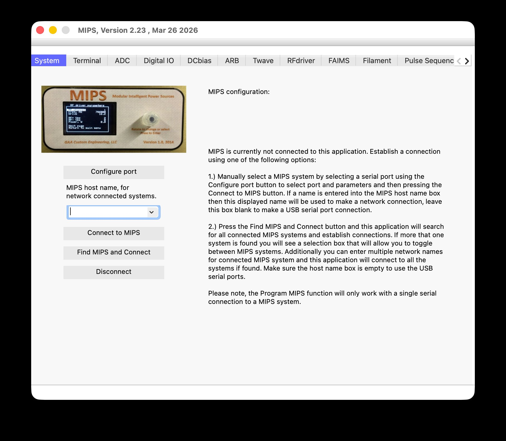
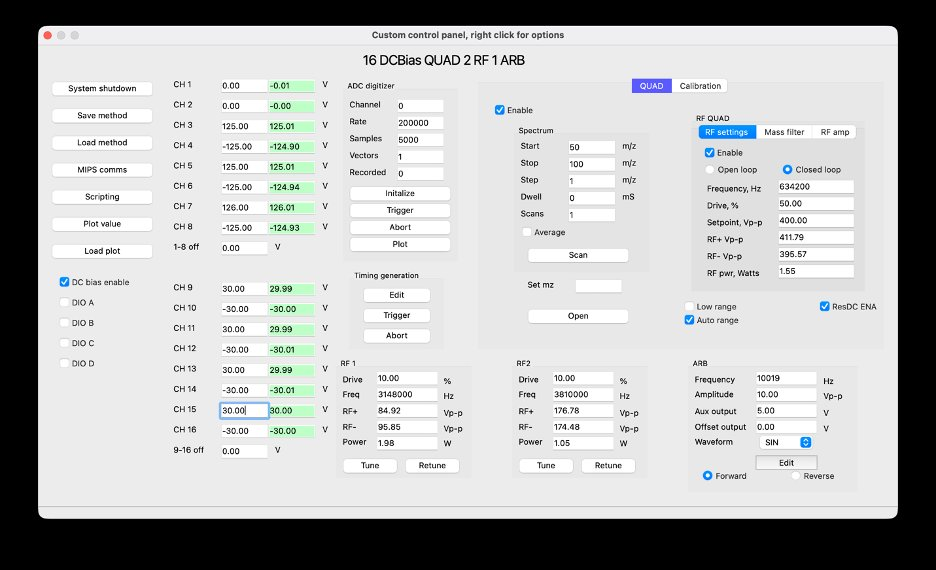

# MIPS QT6

**Host application for the MIPS modular instrument control platform.**

MIPS (Modular Intelligent Power System) controllers are used in scientific
instruments — particularly mass spectrometry and ion mobility systems — to
generate and control high-voltage DC bias outputs, RF drive signals,
traveling-wave ion guides, FAIMS separation fields, and precisely timed pulse
sequences. This Qt 6 desktop application is the primary interface between a
host computer and one or more MIPS controllers.

---

## Features

- **Connect via USB, Wi-Fi, or Ethernet** to one or multiple MIPS controllers simultaneously
- **Tab-based module control** — each detected hardware module gets its own dynamically created tab
- **Custom control panels** — build fully graphical instrument interfaces from plain-text `.cfg` files, with no C++ required
- **ECMAScript scripting** — automate instrument operation with embedded JavaScript
- **Real-time ADC acquisition** — up to 1 MHz sample rate
- **Timing generator** — clock-accurate pulse sequence editor for ion injection, trapping, and release sequences
- **TCP server** — remote control from external applications
- **ZMQ interface** — integrate with data acquisition software via ZeroMQ
- **Firmware upload** — program MIPS controllers directly from the host application

---

## Screenshots

| Main window — System tab | Custom control panel |
|--|---|
|  |  |

---

## Supported Modules

| Module | Description |
|---|---|
| DC Bias | Up to 32 channels of precision DC voltage |
| RF Driver | RF frequency, amplitude, and auto-tuning |
| ARB | Arbitrary waveform generator |
| T-Wave | Traveling-wave ion guide |
| FAIMS | Field asymmetric ion mobility separation |
| DIO | 16 TTL outputs + 8 TTL inputs |
| ADC | High-speed analog data acquisition |
| Filament | Ionisation source current/voltage control |
| Compressor | Multi-pass ion-mobility compressor |
| ESI | Electrospray ionisation high-voltage |
| Modbus | Third-party peripheral integration |
| PSG | Pulse sequence generation |

---

## Requirements

| | |
|---|---|
| **Qt** | 6.7.1 (Qt 6.5 LTS may work but is untested) |
| **IDE** | Qt Creator 13.0.2 recommended |
| **Compiler (macOS)** | Xcode Clang ≥ 14, Apple Silicon or Intel |
| **Compiler (Windows)** | MSVC 2019/2022 or MinGW 11.2+ |
| **Qt modules** | Core, Widgets, SerialPort, Network, PrintSupport, QML |
| **Optional** | ZeroMQ + cppzmq for the `mips.ZMQ()` scripting interface |

---

## Building from Source

### Clone

```bash
git clone https://github.com/GordonAnderson/MIPS_QT6.git
cd MIPS_QT6
```

### Qt Creator (recommended)

1. Open Qt Creator → **File → Open File or Project**
2. Select `MIPS.pro`
3. Choose a Qt 6.7 kit for your platform and click **Configure Project**
4. Press **Cmd+B** (macOS) or **Ctrl+B** (Windows/Linux) to build

### Command line (qmake)

```bash
qmake MIPS.pro
make -j$(nproc)
```

> **macOS note:** No USB drivers are required. Apple's built-in CDC serial
> driver handles the Arduino Due automatically.
>
> **Windows note:** Install the Arduino Due USB driver before connecting.
> Follow the guide at https://www.arduino.cc/en/Guide/ArduinoDue and point
> the installer to the `drivers/` folder.
>
> **Linux note:** Add your user to the `dialout` group before connecting:
> `sudo usermod -aG dialout $USER` then log out and back in.

### ZMQ support (optional)

The `mips.ZMQ()` scripting interface requires ZeroMQ and cppzmq:

```bash
# macOS
brew install zmq cppzmq

# Windows
vcpkg install cppzmq
```

The `MIPS.pro` already contains the correct `INCLUDEPATH` and `LIBS` entries
for both platforms — just install the libraries and rebuild.

---

## Installation (pre-built)

Pre-built binaries and install files are available on the
**[GAA Google Drive](https://drive.google.com/drive/folders/0B3IchPRNYqYIcjZhdGFVMVR1VzQ?resourcekey=0-qTdIhau9LysBytglIla-yg&usp=drive_link)**.

**macOS:** Copy `MIPS.app` to your Applications folder and double-click to launch.

**Windows:** Copy the MIPS folder to any location on your PC and run `MIPS.exe` — no installer required.

---

## Documentation

| Document | Location |
|---|---|
| **User Manual** | [MIPS Resources repository](https://github.com/GordonAnderson/MIPS-Resources) |
| **Developer Guide** | [MIPS Resources repository](https://github.com/GordonAnderson/MIPS-Resources) |
| **In-app help** | Help menu → General Help or MIPS Commands |
| **Revision history** | [`Revision.md`](Revision.md) |

Example configuration files, scripts, and data files are also available in the
[MIPS Resources repository](https://github.com/GordonAnderson/MIPS-Resources).

---

## Custom Control Panels

Control panels are defined by plain-text `.cfg` files and loaded at runtime
via **Tools → Load configuration...**. A panel can:

- Display controls from multiple MIPS systems on one screen
- Bind any MIPS GET/SET command to a UI widget — no C++ required
- Run embedded JavaScript automation scripts
- Expose a TCP server for remote control from external software
- Communicate with external processes via ZeroMQ

See the [User Manual](https://github.com/GordonAnderson/MIPS-Resources) for
the complete `.cfg` syntax and scripting API reference.

---

## Contributing

Contributions are welcome. Please read the **Developer Guide** before making
changes — it covers the architecture, module widget pattern, coding
conventions, and the step-by-step checklist for adding a new hardware module.

**Quick summary of conventions used in this codebase:**

- C++17, Qt 6 modern connect syntax throughout — no `SIGNAL`/`SLOT` macros
- `returnPressed` not `editingFinished` for user-entry line edits
- `nullptr` not `NULL`
- GAA-style file header block on every source file (see any `.cpp` for the template)
- `/*!` doc comment on every public function

**To contribute:**

1. Fork the repository
2. Create a feature branch: `git checkout -b feature/my-change`
3. Commit with a clear message: `feat: add MyModule support`
4. Open a Pull Request against `main`

**Reporting issues:** Please include your Qt version, platform, and MIPS
firmware version (`GVER` in the Terminal tab). See the Developer Guide for
the full bug report checklist.

---

## Project Status

MIPS QT6 is in **active development**. The codebase has undergone a full
refactoring to Qt 6.7.1 with modern C++ conventions throughout, and new
features continue to be added with each release. See [`Revision.md`](Revision.md)
for the full change history going back to v1.0 (July 2015).

Current version: **2.23**

We warmly welcome community partners who would like to contribute — whether
that's adding support for new hardware modules, improving the scripting API,
extending the custom control panel system, or helping with testing across
platforms. Please read the **Developer Guide** before diving in, and don't
hesitate to open an Issue to discuss ideas before writing code.

---

## Licence

This project is licensed under the **GNU General Public License v3.0** —
see the [`LICENSE`](LICENSE) file for details.

---

## Author

**Gordon Anderson**  
GAA Custom Electronics, LLC  
gaa@gaa-ce.com  
www.GAACustom.com
